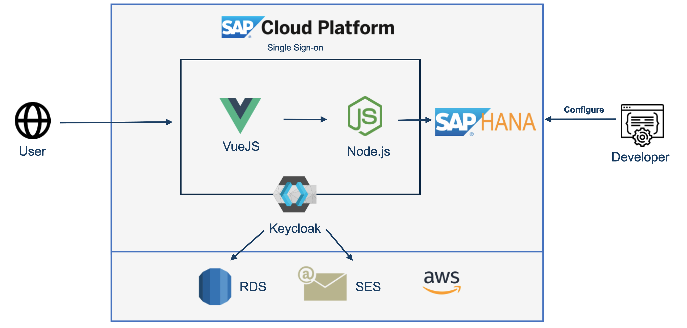

<!-- START doctoc generated TOC please keep comment here to allow auto update -->
<!-- DON'T EDIT THIS SECTION, INSTEAD RE-RUN doctoc TO UPDATE -->
**Table of Contents**  *generated with [DocToc](https://github.com/thlorenz/doctoc)*

- [Cloud Platform - Return to Work Package](#cloud-platform---return-to-work-package)
  - [Requirements](#requirements)
    - [Development](#development)
  - [Keycloak container](#keycloak-container)
    - [Build](#build)
    - [Run](#run)
    - [Development](#development-1)
  - [SAP HANA Container](#sap-hana-container)
  - [Express Container](#express-container)
    - [Development](#development-2)
  - [Vue.js Container](#vuejs-container)
    - [Development server with hotswap](#development-server-with-hotswap)
    - [Compiles and minifies for production](#compiles-and-minifies-for-production)
    - [Deploy to SAP Cloud Platform](#deploy-to-sap-cloud-platform)
    - [Customize configuration](#customize-configuration)
    - [Integration and Links](#integration-and-links)

<!-- END doctoc generated TOC please keep comment here to allow auto update -->

# Cloud Platform - Return to Work Package

**Documentation is WORK IN PROGRESS**  
[SAP Cloud Platform](https://www.sap.com/products/cloud-platform.html) deployable [Keycloak](https://www.keycloak.org/) secured system that deploys multiple microservices that takes advantage of the built in search index, geospatial and text analysis libraries in [SAP HANA](https://www.sap.com/products/hana.html) as well as manage [SAP Cloud Platform Workflows](https://help.sap.com/viewer/product/WORKFLOW_SERVICE/Cloud/en-US) for visitor management

## Requirements
* For deployment on SAP Cloud Platform, a configured [CloudFoundry cli](https://docs.cloudfoundry.org/cf-cli/) with access to a user or [trial](https://www.sap.com/products/cloud-platform.html) account
* For deployment on SAP Cloud Plaform, Keycloak requires a hosted Postgresql backend. Project built with free tier instance from [Amazon RDS](https://aws.amazon.com/rds/)
* Registration email feature in Keycloak requires a sendmail server. Project built with [Amazon SES](https://aws.amazon.com/ses/)

### Development
* [nodejs](https://nodejs.org/en/) environment
* To take advantage of the simplified project deployment scripts you need the following environment variables set. Below are are **example values only**
```bash
export CP_USER=i999111
export CP_PASSWORD=MyAccountPassword55
export PG_ADDR=cp-rtwp.random-string-text.us-east-1.rds.amazonaws.com
export PG_PASSWORD=WholeBunchOfCharacters
```



## Keycloak container


* Deployed with `cf-keycloak.sh`
  * Default vendor, user and database are all `postgres`
  * `PG_ADDR` variable is just the hostname or ip address: `sample-app.abcdefg.us-east-1.rds.amazonaws.com`

* Keycloak security is **disabled** by default. Changing the environment variable to **true** enables integration

### Build
* Requires a [PostgreSQL](https://www.postgresql.org/) backend.
  > This project was developed with a free tier [Amazon RDS](https://aws.amazon.com/rds/) instance.
* Run the build script to copy over the custom [CoreUI](https://coreui.io/ ) based theme
```bash
cd keycloak
./docker-build.sh
```
### Run
* Update `keycloak/docker-run.sh` to have the values for your PostgreSQL instance.
  >`PG_ADDR` and `PG_PASSWORD` are externalized to environment variables to avoid being checked into source control

```bash
cd keycloak
./docker-run.sh
```

### Development
* Make sure the keycloak container is running. Get the id of the running container from this command
```bash
docker ps -f ancestor=quay.io/mechevarria/keycloak-coreui | awk '{print $1}'
```
* Copy the over the theme directory from the container by replacing `$container` with the value from the previous command. The system themes are automatically ignored by git
```bash
docker cp $container:/opt/jboss/keycloak/themes keycloak/
```
* Build a development image (turns off caching of pages)
```bash
cd keycloak
./docker-build-dev.sh
```
* Run the development image (mount the local themes directory)
```bash
cd keycloak
./docker-run-dev.sh
```
* Changes made locally to `keycloak/themes` will be seen when you refresh server pages in your browser.

## SAP HANA Container
* Deployed with `cf-db.sh`
* A container named `hdi-hana-deployer` will be created in SAP Cloud Platform to deploy the hana database, populate data and create tables, indexes, etc. The container will then be stopped once complete

## Express Container
> Requires the SAP HANA database container to be deployed. Local development requires the SAP HANA host to whitelist external addresses

### Development
* Inside the `rtwp-api` run the following to install all dependencies
```bash
npm install
```

* Start a development server with changes hot deployed
```bash
cd rtw-api
npm install
./local-run.sh
```

* Deployed with `cf-express-api.sh`
* Change the `KEYCLOAK` environment variable to **true** to enable sso integration

## Vue.js Container
> Requires the Express container to be deployed

### Development server with hotswap
```bash
cd rtwp-admin
npm install

./local-setup.sh

npm run serve
```

* The server will be running on [http://localhost:4200](http://localhost:4200)

### Compiles and minifies for production
```bash
npm run build
```

### Deploy to SAP Cloud Platform

>You can create an account for free at [SAP Cloud Platform](https://www.sap.com/products/cloud-platform.html)

* Make sure you have the [Cloud Foundry Command Line Interface (cf CLI)](https://docs.cloudfoundry.org/cf-cli/) installed

* Update the `cf-login.sh` script with the values found in the SAP Cloud Foundry Cockpit. Then run the script to login.

```bash
./cf-login.sh
```

* Push your code directly without the need of a container registry with the following commands (make sure you have done a build ahead of time)


```bash
./cf-rtwp-admin.sh
```

* You will find a url to your deployed application in the SAP Cloud Foundry Cockpit.

### Customize configuration
See [Configuration Reference](https://cli.vuejs.org/config/).

### Integration and Links

* [Vue cli](https://cli.vuejs.org/) used to generate this project
* [Style Guide](https://vuejs.org/v2/style-guide/) for Vue. Attempting to follow as best as possible
* [CoreUI Bootstrap](https://coreui.io) theme
* [Bootstrap-Vue](https://bootstrap-vue.org/) components
* [Vue Router](https://router.vuejs.org/) for view management
* [Vuex](https://vuex.vuejs.org/) for state management
* [vue-mobile-detection](https://github.com/ajerez/vue-mobile-detection) for checking mobile state
* [axios](https://github.com/axios/axios) as http client
* [vue-keycloak-js](https://github.com/dsb-norge/vue-keycloak-js) for SSO integration
* [Vue2Leaflet](https://github.com/vue-leaflet/Vue2Leaflet) map integration
